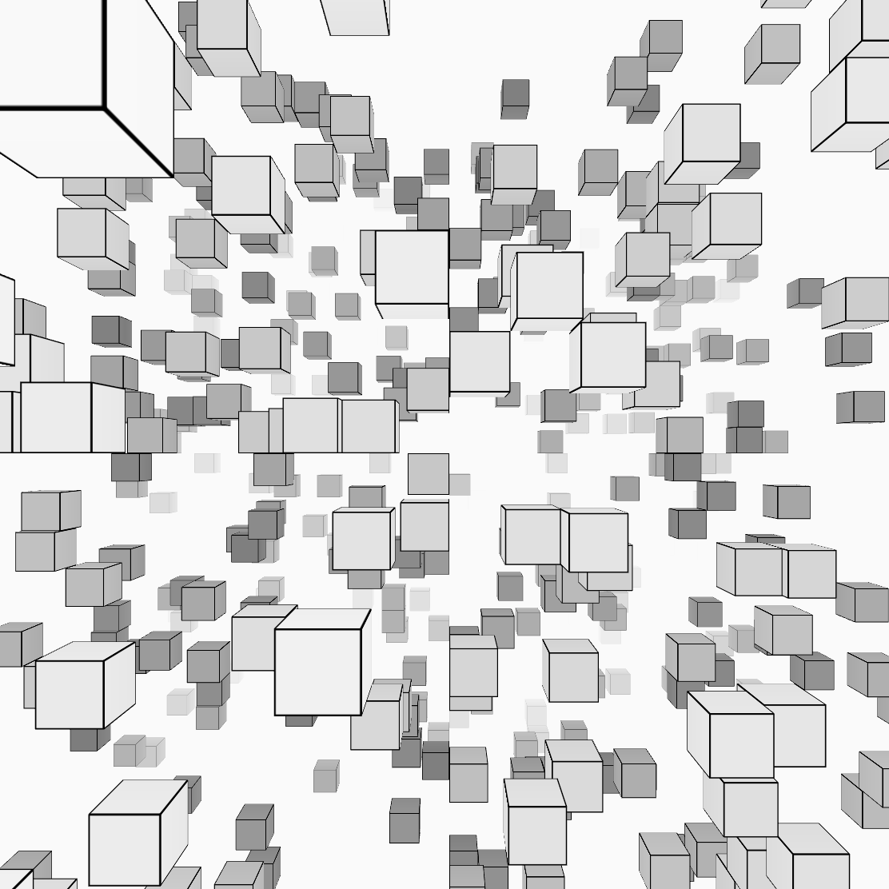
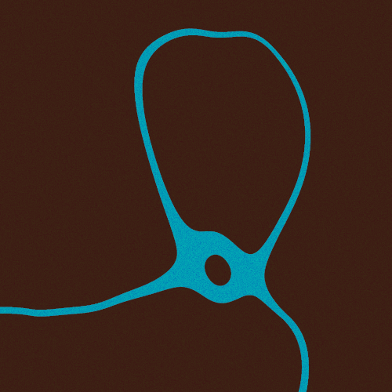
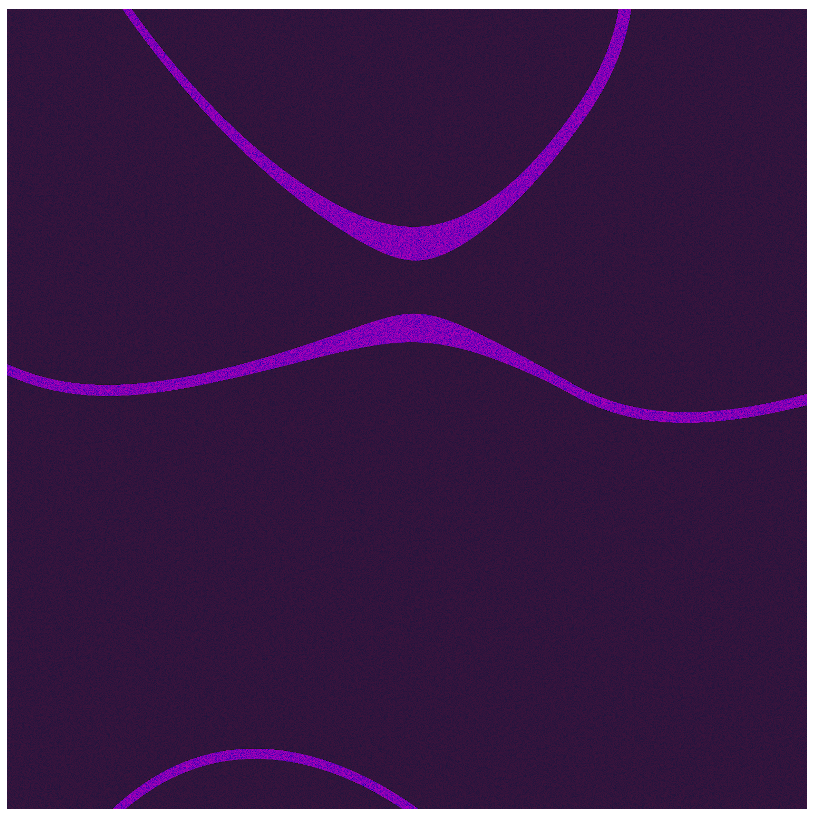
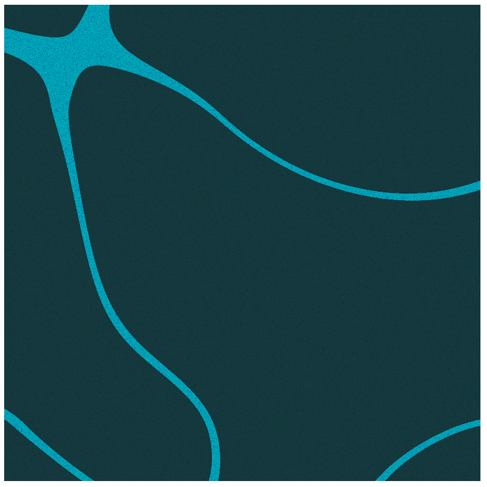
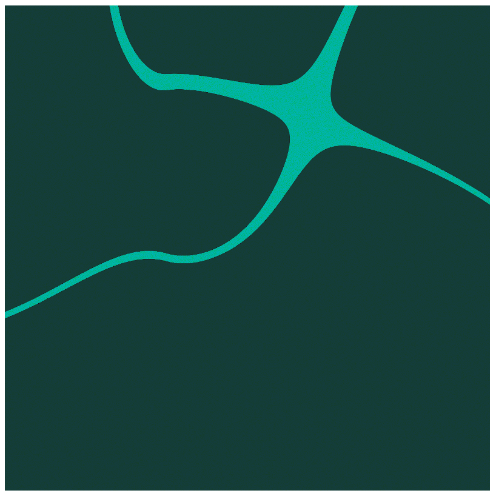
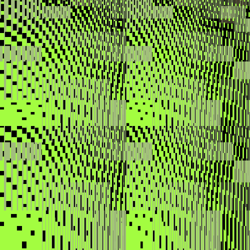
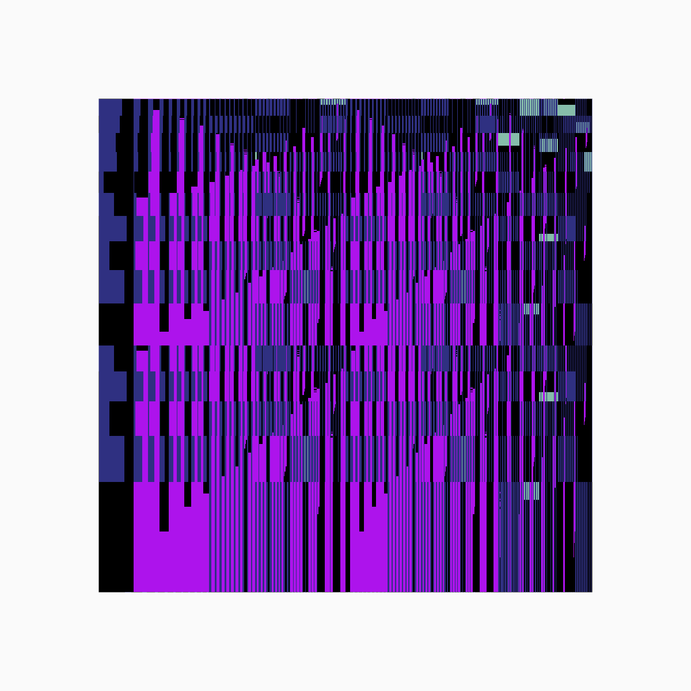
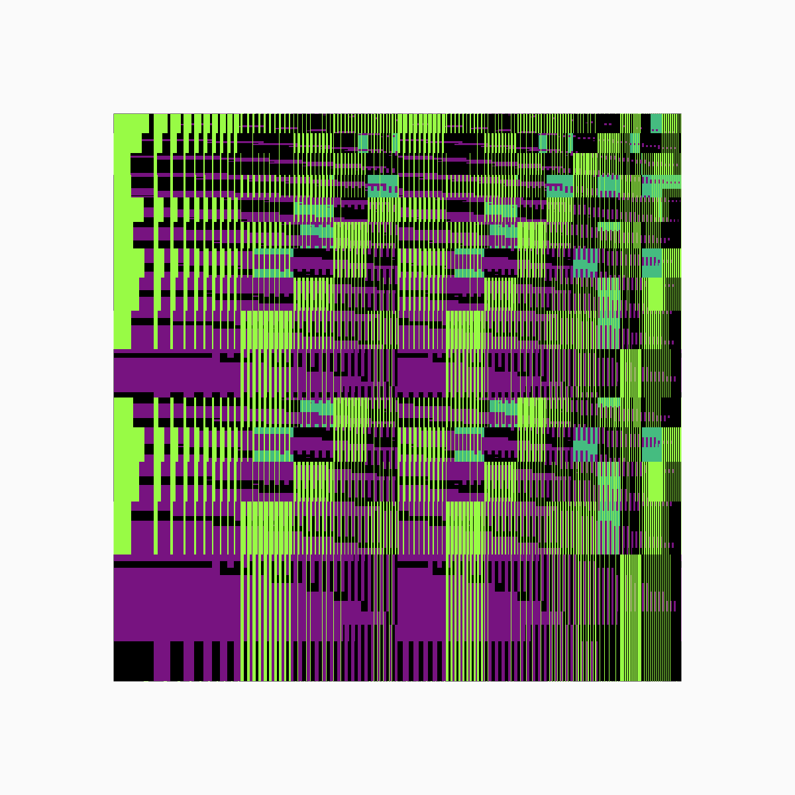
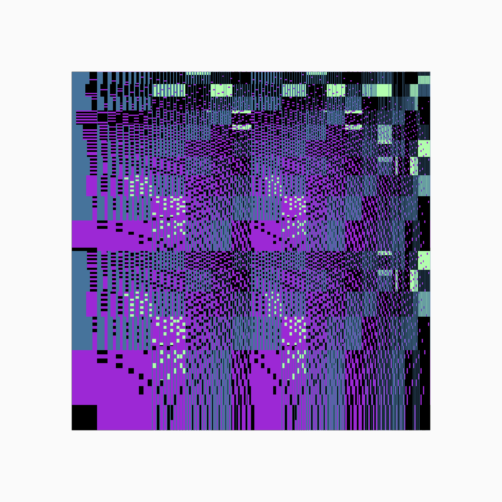

# Genuary 2023

[Live Website](https://lorismat-genuary2023.vercel.app/)  

## About the code

The website is a `Nuxt` application.  
All my prompts are made with Three.js and/or glsl and are available in this repository.  
All prompts are `vue` components using `Three.js` accessible in `components/Canvas/CanvasX.vue`.  
Some of the prompts run shaders, accessible in `assets/glsl/X`, `X` being the prompt day.  

You can use any part of the code but please let me know if you do! And leave the credits where I left them, if any.

## Prompts

_All previews will be updated by Jan 31st_

#### #1 Perfect loop / Infinite loop / endless GIFs  

#### #2 Made in 10 min  

#### #3 Glitch Art

4. Intersections
5. Debug view
6. Steal Like An Artist
7. Sample a color palette from your favorite movie/album cover
8. Signed Distance Functions
9. Plants
10. Generative music
11. Suprematism
12. Tessellation
13. Something you’ve always wanted to learn 
14. Asemic writing - using lines and symbols that look like writing, but do not have any meaning
15. Sine waves
16. Reflection of a reflection
17. A grid inside a grid inside a grid
18. Definitely not a grid
19. Black and white
20. Art Deco
21. Persian Rug
22. Shadows
23. More Moiré
24. Textile
25. Yayoi Kusama
26. My kid could have made that
27. In the style of Hilma Af Klint
28. Generative poetry
29. Maximalism
30. Minimalism
31. Deliberately break one of your previous images, take one of your previous works and ruin it.